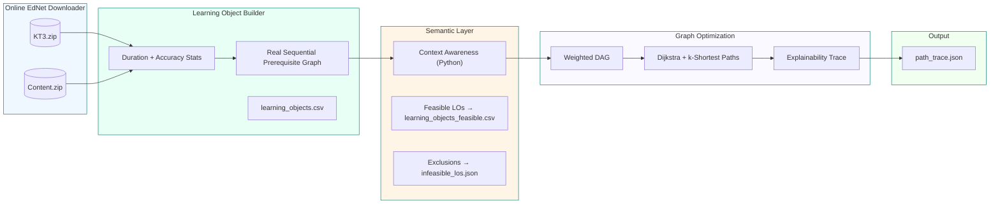

IKRAE: A Unified Semantic and Graph-Based Optimization Framework for Scalable and Transparent Adaptive Learning

A Research Study by | Aziz Abdelkarim, Faddoul khoukhi and Kabba Fatima Ezzahra.
Computer Science Lab, Faculty of sciences and technics, Mohammedia - Casablanca. 

Dataset: Real EdNet (131M interactions)  

[](https://doi.org/10.5281/zenodo.17464127)
[](LICENSE)
[](https://www.python.org/downloads/)
[](docker/Dockerfile)


---

📘 Overview

IKRAE as (Intelligent Knowledge-based Recommendation for Adaptive Education)
is a unified semantic and graph-based optimization framework that generates:

- Context-aware learning paths
- Real-time adaptation (<200ms)
- Explainable recommendations
- Pedagogically valid sequencing

All results are computed using real EdNet-KT3 data (131M interactions, 784K learners).

This repository includes:

- An online EdNet loader (no manual CSVs needed)
- A semantic filter layer (language, device, mastery, bandwidth)
- A graph-based path optimizer (Dijkstra + k-shortest paths)
- A fully reproducible pipeline (`run_pipeline.sh`)
- Optional Java/HermiT reasoner for OWL + SWRL

---
## 📦 Dataset

This project uses the **IKRAE Clean EdNet KT3 Dataset**, openly available on Zenodo:

**🔗 DOI:** https://doi.org/10.5281/zenodo.17664110  

The dataset is a cleaned, deduplicated, and preprocessed version of the EdNet-KT3 interaction logs, prepared specifically for the IKRAE adaptive learning framework.

To use it:

```bash
mkdir -p data/
wget https://zenodo.org/record/17664110/files/ikrae_kt3_clean.zip
unzip ikrae_kt3_clean.zip -d data/

---
```
 🧪 Reproducibility Statement

> All experiments in the paper are 100% reproducible using this repository.**  
> • No synthetic data — only real EdNet-KT3  
> • Online download of KT3 and content files  
> • Runtime and cost metrics match the published results  

| Paper Claim | Repo Component | Command |
|------------|----------------|---------|
| Scalability | `run_experiments.py` | `python src/run_experiments.py` |
| Constraint Satisfaction | `ikrae_reasoner.py` | `python src/ikrae_reasoner.py` |
| Re-planning <200ms | `ikrae_optimizer.py` | `./run_pipeline.sh` |
| EdNet integration | `ednet_loader.py` | Auto-downloads KT3 |

---

 🧩 IKRAE-EdNet Pipeline Overview

```mermaid
flowchart LR
    subgraph A[Online EdNet Downloader]
        A1[(KT3.zip)]
        A2[(Content.zip)]
    end

    subgraph B[Learning Object Builder]
        B1["Duration + Accuracy Stats"]
        B2["Real Sequential Prerequisite Graph"]
        B3["learning_objects.csv"]
    end

    subgraph C[Semantic Layer]
        C1["Context Awareness (Python)"]
        C2["Feasible LOs → learning_objects_feasible.csv"]
        C3["Exclusions → infeasible_los.json"]
    end

    subgraph D[Graph Optimization]
        D1["Weighted DAG"]
        D2["Dijkstra + k-Shortest Paths"]
        D3["Explainability Trace"]
    end

    subgraph E[Output]
        E1["path_trace.json"]
    end

    A1 --> B1
    A2 --> B1 --> B2 --> C1 --> D1 --> D2 --> D3 --> E1

    style A fill:#f0f8ff,stroke:#088178,stroke-width:1px
    style B fill:#e7fff5,stroke:#088178,stroke-width:1px
    style C fill:#fff5e7,stroke:#088178,stroke-width:1px
    style D fill:#f9f9ff,stroke:#088178,stroke-width:1px
    style E fill:#f0fff0,stroke:#088178,stroke-width:1px
```
 📄 User Context

IKRAE takes a simple JSON file describing the learner context:

`experiments/user_context.json`:

```json
{
  "user_id": "U123",
  "language": "en",
  "device": "mobile",
  "bandwidth": "low",
  "mastery_level": 0.65,
  "time_budget_min": 25
}
```
📊 Example Output (path_trace.json)
```
{
  "runtime_ms": 147.2,
  "real_time_compliant": true,
  "primary_path": ["START", "Q_17", "Q_44", "Q_88", "GOAL"],
  "excluded_los": [
    {"lo_id": "L_55", "reason": "low bandwidth + video"},
    {"lo_id": "Q_210", "reason": "requires mastery 0.80 > user mastery 0.65"}
  ]
}
```
📁 Repository Structure
```
IKRAE/
│
├── src/
│   ├── ednet_loader.py        # Online EdNet + LO stats + real prerequisites
│   ├── ikrae_reasoner.py      # Context-aware semantic filter
│   ├── ikrae_optimizer.py     # Graph optimizer
│   └── run_experiments.py
│
├── experiments/
│
├── contexts/              # User context profiles
│   ├── context_high_mastery.json
│   ├── context_low_bandwidth.json
│   ├── context_low_mastery.json
│   └── user_context.json
│
├── figures/               # Paper figures (runtime, diversity, feasibility)
│   ├── runtime_scalability.png
│   ├── feasible_graph.pdf
│   └── k_paths.pdf
│
├── graphs/                # Graph experiments
│   ├── base_graph_200.pkl
│   ├── base_graph_1000.pkl
│   ├── base_graph_5000.pkl
│   ├── base_graph_10000.pkl
│   ├── base_graph_50000.pkl
│   ├── base_graph_100000.pkl
│   ├── generate_base_graph.py
│   ├── Gf.pkl             # Final feasible graph used in the paper
│   ├── pos.pkl            # Graph layout
│   └── paths.pkl          # Primary + k alternative paths
│
├── notebooks/
│   └── IKRAE_plots.ipynb  # Generate paper figures
│
└── results/
    ├── learning_objects.csv    # Node metadata (semantic tags)
    └── prerequisites.csv       # Edge list (prerequisites)
│
├── ontology/                  # Optional: OWL + SWRL (Java/HermiT)
│
├── run_pipeline.sh
└── requirements.txt
```
📜 Citation
```
@software{ikrae2025,
  title  = {IKRAE: A Unified Semantic and Graph-Based Optimization Framework for Scalable and Transparent Adaptive Learning},
  author = {Aziz Abdelkarim},
  year   = {2025},
  version = {1.0.0},
  doi    = {10.5281/zenodo.17464127},
  license = {MIT}
}
```
